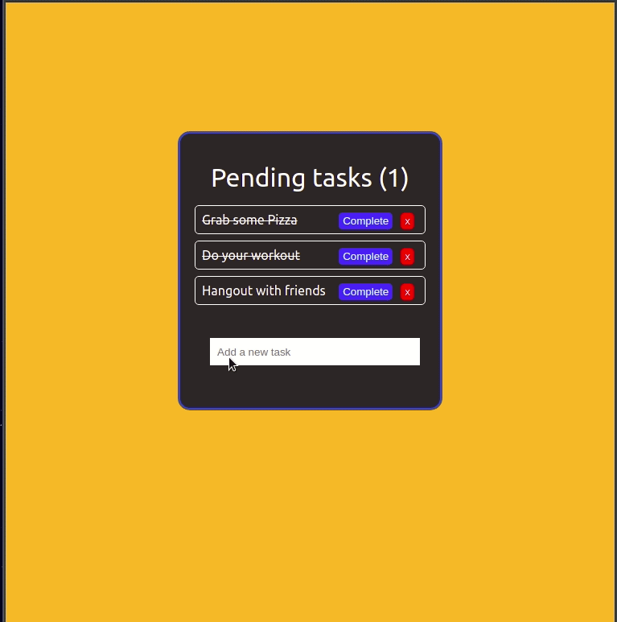

# Exercise 1 - React-todo

For this exercise, you will build a TODO list app, written in React.js

**Core Requirements:**
* -View Todo List
* -Add a todo
* -Delete a todo
* -Delete all todos
* -Mark todo as completed
* -App should have basic styling

**Optional :**

* Store data using another state management solution ([context](https://reactjs.org/docs/context.html), [redux](https://redux.js.org/), [recoil](https://recoiljs.org/), etc.)
* Animations on deleting / adding todos
* Incorporating a 3rd party library for functionality or styling.  (Material-ui,Reactstrap,Styled Components, SCSS)

Below are some design ideas for todo list apps : 

## ********************************************************
## Git Instructions

- [ ] Create a template copy of this repository by clicking : "Use this template"
- [ ] Name the repository the same name as the master template repository.  
- [ ] Add your TM as collaborator
- [ ] Clone YOUR repo to your local computer
- [ ] Create a new branch: <code>git checkout -b `<firstName-lastName>`</code>.
- [ ] Implement the project on your newly created `<firstName-lastName>` branch, committing changes regularly.
- [ ] Push all of your commits: <code>git push origin `<firstName-lastName>`</code>.
- [ ] When ready for your TM to review, open a Pull Request (PR) and add your TM as a collaborator.

## ********************************************************

